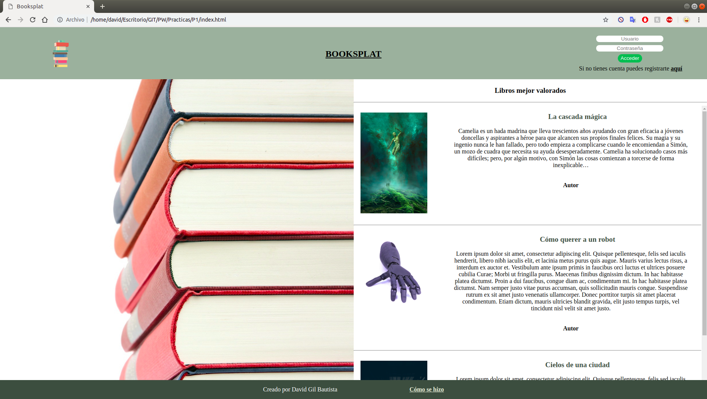
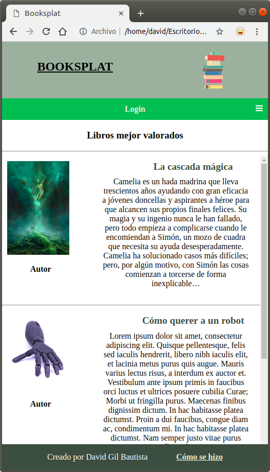
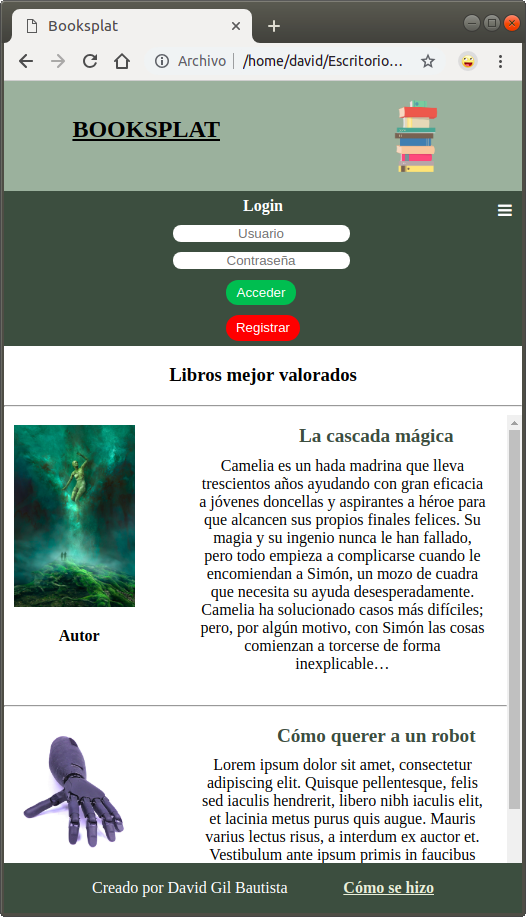

# Memoria práctica 1

##### David Gil Bautista

##### 45925324M

###### davidbautista@correo.ugr.es

### Introducción y descripción del problema

El objetivo de esta práctica era realizar una aplicación web que recojería la información y opinión de distintos usuarios sobre libros que hayan leído con el fin de que el sistema sirva como recomendador. Lo principal sería crear una landing page donde el usuario pudiera ver los libros mejor valorados y poder registrarse o iniciar sesión en el sistema. Una vez el usuario accede logueado al sistema aparece en la misma página, variando que ahora tiene una barra de navegación que le permite acceder a las distintas secciones del sistema.

 

