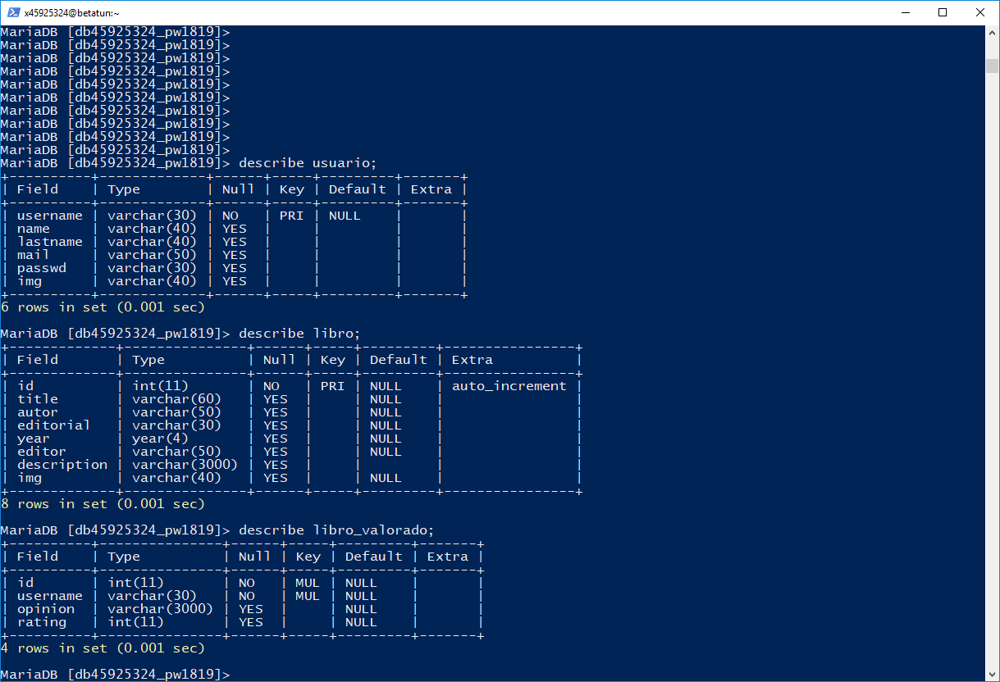

# Cómo se hizo

### Práctica 2 - Programación Web

##### [David Gil Bautista](https://github.com/DavidBaug)

##### [Contacto](mailto:davidgilbautista@gmail.com)

## Índice

- ### [Usuarios y libros](#id1)

- ### [Login y logout](#id2)

- ### [Modificación mis datos](#id3)

- ### [Alta libro](#id4)

- ### [Modificación opinión](#id5)

## Usuarios y libros

Para comenzar debemos crear la base de datos y estructurar las tablas que usaremos para la página. Para ello he optado por usar una tabla por cada "item". Una tabla para guardar la tabla que recoja los datos de un usuario, otra para recoger la información de un libro y otra más para asociar la opinión de un usuario sobre un libro. Sabiendo esto he creado las siguientes tablas:

En la tabla del **libro valorado** podemos ver que tenemos una clave múltiple que hace referencia a la tabla **libro** y a la tabla **usuario**, es decir, para poder crear la opinión de un libro deberá existir el libro y el usuario. Cosa que puede hacer que a la hora de introducir un libro nuevo con su opinión nos cause algún problema, pero veremos cómo resolverlo después.

Y en **libro** tendremos una clave que iremos aumentando conforme insertemos tuplas.

Para crear e insertar tuplas de las instancias anteriores he creado archivos específicos que realizan estas acciones tras completar el formulario y enviarlo. He optado por recoger todas las valoraciones sobre un libro en distintas tablas, cosa que nos facilitará mostrar los libros leídos en la sección mis libros y calcular la valoración media de un ejemplar específico.

## Login y logout

Para el acceso al sistema y la desconexión uso un formulario en la cabecera y tras rellenar los datos o pulsar el botón de desconexión llamo a las funciones php encargadas de cerrar o iniciar la sesión, para el inicio se busca en la base de datos un par usuario-contraseña que coincida con alguna tupla de la tabla, y si se encuentra se fijan las variables del sistema con los datos del usuario. Obviamente las variables del formulario son obligatorias.

Para la desconexión se borran las variables y se cierra la sesión del servidor.

En caso de no cerrar la sesión esta permanece abierta por lo que tras cerrar la página y volver a acceder a ella entraremos directamente como si hubieramos introducido los datos y hubiérmos iniciado la sesión.

## Alta de usuario y modificación de los datos personales

En caso de no tener un usuario registrado en el sistema deberemos darlo de alta. Al entrar en el registro encontramos un formulario en el que todos los campos son obligatorios y en los que mediante javascript y html controlo los datos que el usuario introduce. En caso de cumplirse todas las condiciones se envían los datos a una función php que los introduce en la base de datos.

Una vez se mandan los datos, por seguridad comprobamos que todos los campos tienen valor, y sabiendo que estos cumplen las condiciones para poder ser insertados en la base de datos creamos la sentencia sql y la ejecutamos, comprobamos si la acción se ha realizado correctamente y en caso contrario mostramos que se ha dado un cierto error.

A la hora de modificar los datos nos encontramos ante una situación similar a la del alta, pero en este caso no será obligatorio rellenar todos los campos 